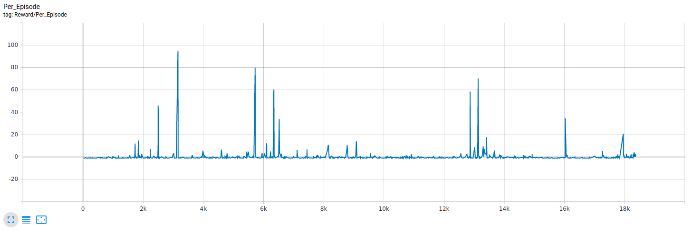

# Shiva

Deep Reinforcement pipeline leveraging population based training for continuous and discrete action spaces. Adaptable to game environments by creating a game specific environment wrapper.

Get started with the Installation and then thru the Quickstart to see how to run a session. The Tutorial section goes in more details about Shiva to familiarize with it's components and then be able to extend new algorithms.

## Table of Content

1. [Requirements and Installation](./shiva/docs/Getting-Started.md)
2. [Quickstart](./shiva/docs/Quick-Start.md)
3. Tutorial
    * Project Layout
    * Classes
        * [Algorithm](./shiva/docs/Algorithms.md)
        * [Agent](./shiva/docs/Agents.md)
        * [MetaLearner](./shiva/docs/Metalearners.md)
        * [Learner](./shiva/docs/Learners.md)
        * [Environment](./shiva/docs/Environments.md)
        * [Network](./shiva/docs/Networks.md)
        * [Buffer](./shiva/docs/Buffers.md)
        * [Admin](./shiva/docs/Admin.md)
    * [Configuration files](./shiva/docs/Config-Files.md)
    * Example Environments
4. How to extend Shiva
    * [UnitTests](./shiva/docs/UnitTests.md)
    * [Creating a new algorithm](./shiva/docs/Extending-Algorithm.md)
    * Creating a new environment wrapper
    
## Benchmarks

You can use these benchmarks to test if changes made to Shiva were improvements.

### Gym Cartpole

#### Episodic Reward

#### Actor Loss

#### Critic Loss

### Unity 3DBallDiscrete 

We implemented a discrete version of 3DBall for discrete testing in lieu of Basic.

#### Episodic Reward

#### Actor Loss

#### Critic Loss

## Restrictions

If you would like to contribute to Shiva, we would like you to do so by providing your own implementations of the abstract modules to maintain stability. If you have difficulties with any of the existing modules please raise an issue on the repository.
