# Benchmarks

You can use these benchmarks to test if changes made to Shiva were improvements.

## MADDPG

### Gym Cartpole

#### Episodic Reward
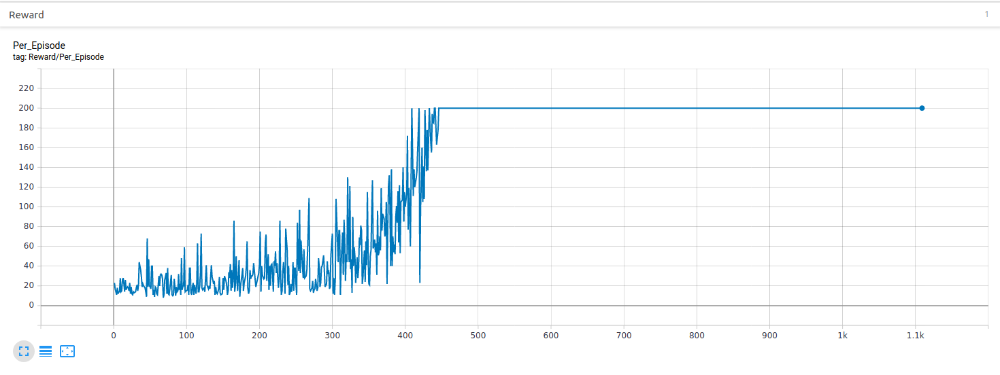

#### Actor Loss
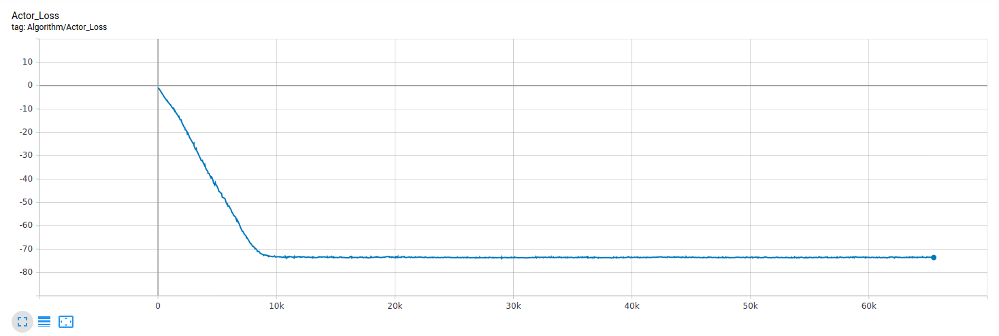

#### Critic Loss
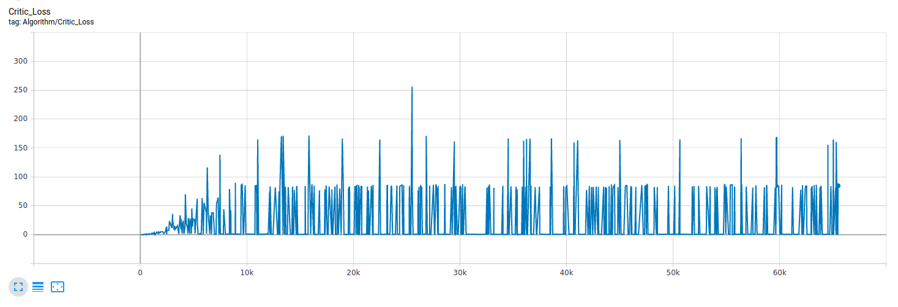

### Unity 3DBall

#### Episodic Reward
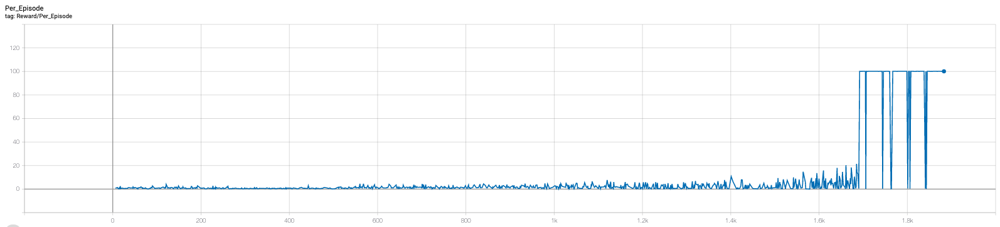

#### Actor Loss
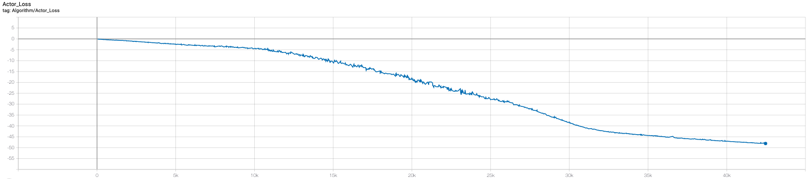

#### Critic Loss
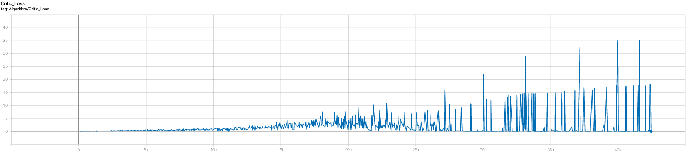

### Unity 3DBallDiscrete 

We implemented a discrete version of 3DBall for discrete testing in lieu of Basic.

#### Episodic Reward

#### Actor Loss
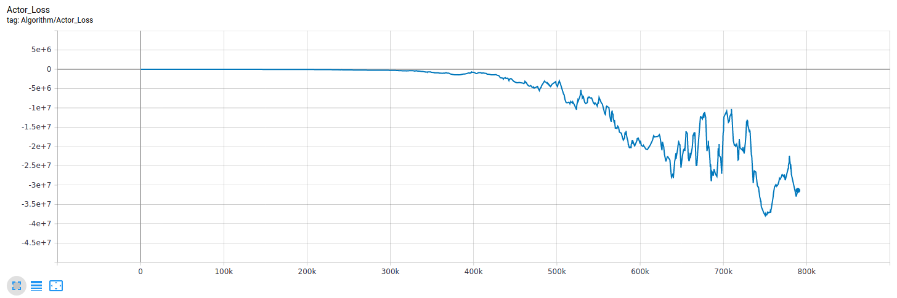

#### Critic Loss
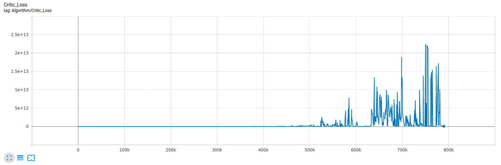

### Unity Food Collector

#### Episodic Reward
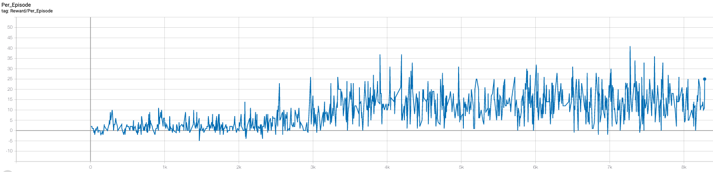

#### Actor Loss
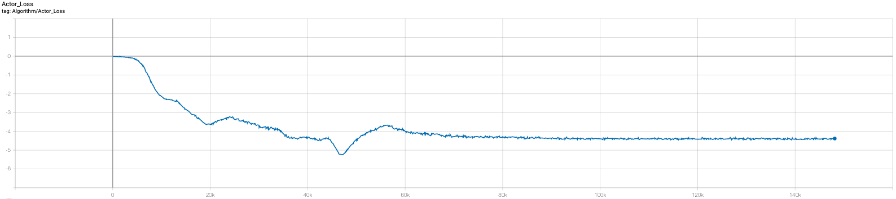

#### Critic Loss
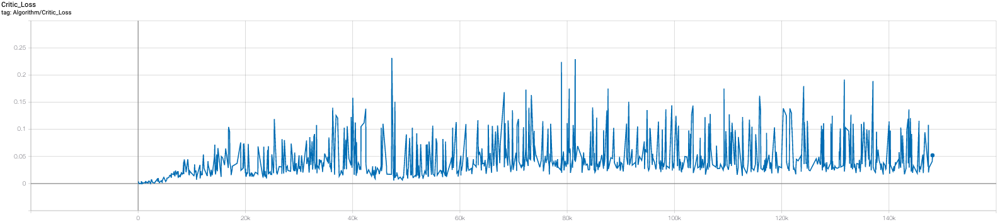

## DQN

### Gym Cartpole

#### Episodic Reward
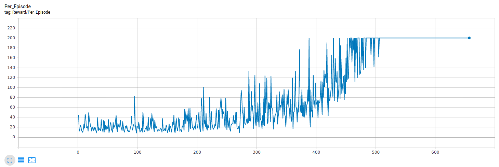

#### Critic Loss
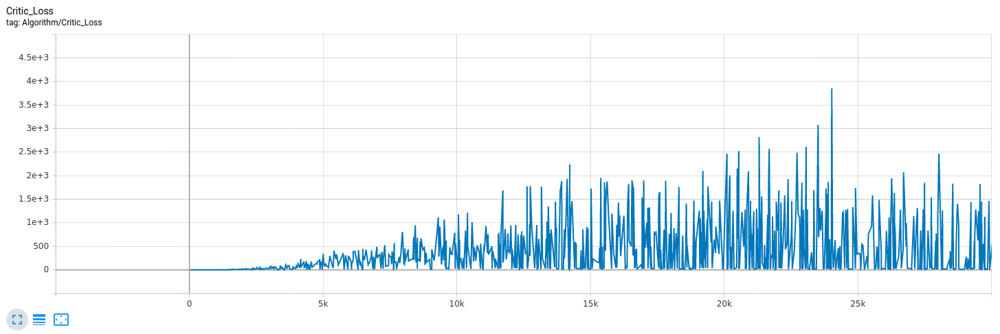

### Unity 3DBallDiscrete 

We implemented a discrete version of 3DBall for discrete testing in lieu of Basic.

#### Episodic Reward
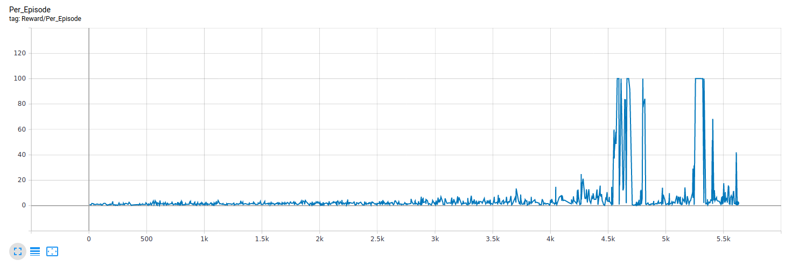

#### Critic Loss
Needs to be added.
